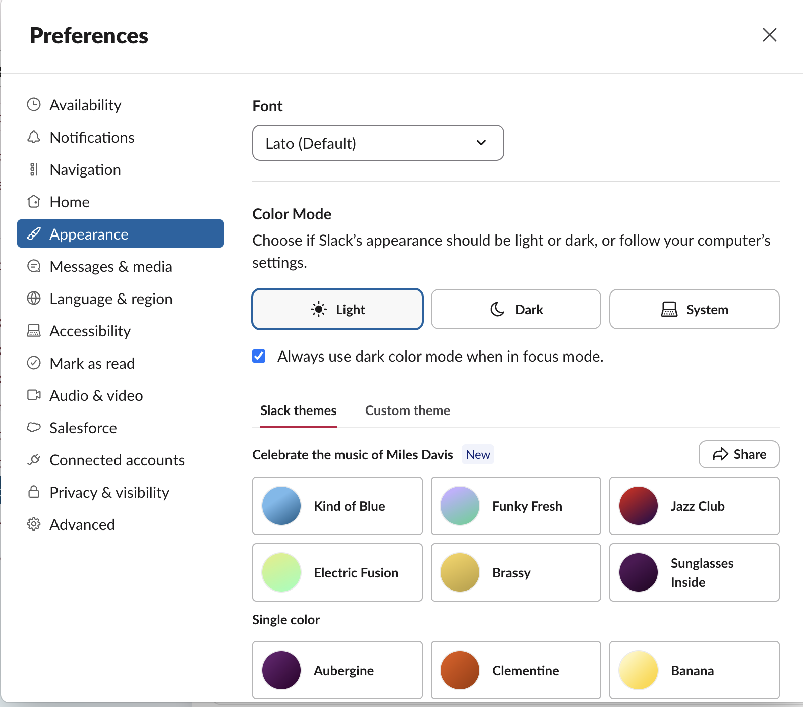
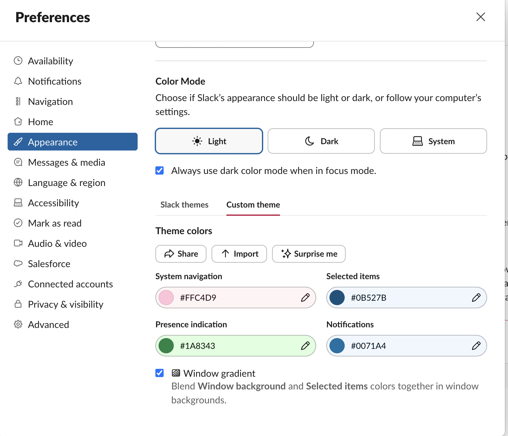

# Workshop Appearance and Personalization Brief

## Status

Product handoff for the Workshop agent. This document records Lindsay's
requested feature and the supplied interaction references. It is not an
implementation record and does not authorize a release.

An earlier planning document exists at
[`workshop-theme-preferences-plan.md`](workshop-theme-preferences-plan.md).
Reconcile that plan with this brief before implementation. Where they conflict,
this brief reflects the newer direction.

## Product goal

Add a Workshop-owned Preferences experience on macOS. It should let a person:

1. choose one of ten curated Workshop color palettes;
2. create and save a custom palette from their own hex colors;
3. customize the two initials used by Workshop's personal brand mark;
4. have that mark automatically use the selected theme's gradient; and
5. view and change private tool-folder selections from Settings as an
   alternative to doing so inside each tool.

This is a Workshop feature. Slate and other installed apps should inherit
Workshop's semantic theme tokens; they should not own or persist a competing
global theme.

## Primary interaction reference

Use Slack's Preferences interaction as a reference for hierarchy and clarity,
not as a visual system to copy wholesale.

### Preset palette reference

Relevant traits:

- a dedicated Preferences surface with left-side section navigation;
- Appearance is a first-class settings section;
- preset themes are presented as compact selectable cards;
- each card combines a visible name, a gradient/color swatch, and a clear
  selected state;
- options scan as a grid rather than as a long select menu.

### Custom palette reference

Relevant traits:

- presets and custom configuration are separate but adjacent modes;
- each custom color has a clear semantic purpose;
- hex values remain visible and editable;
- the selected colors and resulting gradient can be previewed before saving;
- invalid input needs an inline, recoverable error rather than silently
  applying a broken theme.

Slack's official behavior reference:
[Change your Slack theme](https://slack.com/help/articles/205166337-Change-your-Slack-theme).

## Scope for this release

### Preferences entry point

- Add **Preferences…** (or the correct current macOS convention) to the native
  Workshop application menu.
- Open a Workshop-owned Preferences surface without changing the active tool,
  route, document, workspace state, or update state.
- Include at least two settings sections:
  - **Appearance**
  - **Folders** or **Workspaces**
- Existing update settings/status may be incorporated coherently, but should
  not distort the Appearance work.

### Ten curated palettes

- Ship exactly ten hard-coded palettes in the initial version.
- One preset is the current Workshop look and remains the default:
  black/near-black surfaces, pink primary accent, yellow secondary accent, and
  the current warm pink/orange/yellow gradient character.
- Define the other five through a product-design pass. They need distinct
  names, recognizable swatches, coherent gradients, readable semantic colors,
  and sufficient contrast—not ten near-identical accent substitutions.
- Display presets as accessible radio-card choices similar to the supplied
  Slack reference.
- Selecting a preset should provide an immediate truthful preview. Persistence
  behavior must be explicit: either selections apply immediately and persist,
  or the surface provides Save/Cancel. Do not mix both models.

### Custom palette

- Provide a custom theme mode adjacent to the ten presets.
- Support bringing a set of hex codes into Workshop, including a paste-friendly
  text field as Lindsay requested.
- Parse the supplied colors into clearly labeled semantic roles. The UI may
  additionally expose individual color fields/pickers when that improves
  correction and understanding.
- Validate syntax, required color count, supported format, duplicates where
  meaningful, contrast, and unsafe/unreadable combinations.
- Preserve invalid draft text while explaining what needs correction. Never
  apply or persist an invalid palette.
- Show the resulting application colors and logo gradient before saving.
- Provide a clear route back to the default Workshop palette.
- Custom themes are local UI preferences. Do not store them in a tool's private
  workspace, Slate configuration, or a public repository.

### Personal initials and generated brand mark

- Replace the hard-coded `LB` personal mark with a user-configurable value.
- Accept exactly two visible initials after trimming and normalization. Define
  and test behavior for lowercase input, whitespace, punctuation, emoji,
  pasted strings longer than two characters, empty input, and non-Latin text.
- Render the chosen initials anywhere Workshop currently uses the personal
  brand mark.
- Generate the mark's background from the active theme gradient, whether the
  theme is a bundled preset or a valid custom palette.
- Include a live mark preview in Appearance.
- Persist initials locally alongside other Workshop appearance preferences.
- Provide a reset to the shipped default initials and theme.
- This feature changes Workshop's in-app generated mark. Replacing signed macOS
  bundle icons, Dock icons, installer artwork, or repository image assets is
  not automatically in scope; investigate those surfaces and state precisely
  which ones can update at runtime.

### Folder management in Preferences

- Add a Workshop-owned Settings route for reviewing private folder selections
  outside an individual tool's UI.
- Show each installed tool that declares a private workspace requirement, its
  current remembered folder state, and appropriate actions to select/change or
  forget that folder.
- Reuse Workshop's existing generic workspace lifecycle. Do not add Slate-named
  host behavior or teach Workshop the contents of `slate.config.json`.
- Changing or forgetting a remembered folder must not edit, move, discover, or
  delete the folder or its contents.
- Handle missing folders, revoked macOS document access, validation errors,
  cancellation, reconnecting, and tools that manage their own connection
  differently.
- A remembered path and macOS permission are separate states. Renewing access
  should not force the user to remember and retype the path.

## Explicit non-goals

- Do not implement light mode, dark-mode switching, or follow-system mode in
  this release. The architecture must leave room for them later, but the first
  release themes the current dark Workshop interface only.
- Do not add cloud sync, accounts, theme sharing, public theme galleries,
  random theme generation, or remote palette imports.
- Do not put private folder paths or custom palettes in Git-tracked files.
- Do not make theme adoption an install requirement for third-party Workshop
  apps. Host token inheritance should be progressive and provide standalone
  fallbacks.
- Do not hard-code Slate, Pulse, or another tool into global theme logic.

## Ownership and persistence

- Workshop owns the Preferences UI, preset definitions, custom-palette schema,
  initials, validation, persistence, semantic CSS tokens, and generated mark.
- Store a versioned local appearance preference in Workshop's local application
  UI storage. Invalid or future-version state must fall back safely.
- Tool-folder selections continue to use Workshop's existing versioned local
  workspace-selection storage and generic validation boundary.
- Installed tools consume semantic CSS variables with their own standalone
  fallbacks. They do not import Workshop source files.
- Theme changes must not alter tool data, source Markdown, configuration files,
  routes, installation state, or favorites.

## Design expectations

- Apply the `design-product-features` skill from product contract through
  production proof.
- Compare at least two materially different Workshop-specific Preferences
  compositions before selecting the direction. The Slack screenshots establish
  the interaction reference, not the required density, colors, or exact layout.
- Prototype the populated Appearance view, custom-editor draft, validation
  failure, folder-management state, missing/revoked folder state, reset flow,
  saving state if applicable, and narrower window behavior.
- Use real Workshop content and realistic path lengths in the prototype.
- Keep controls visually obvious, focusable, keyboard operable, and properly
  labeled. Radio-card selection must expose radio semantics rather than merely
  looking selected.
- Check all preset and custom-derived text/background, control, selection, and
  focus combinations for readable contrast. Color cannot be the only selected
  indicator.

## Required behavioral coverage

| Job | Success | Failure/recovery |
| --- | --- | --- |
| Open Preferences | Opens above the current Workshop context without resetting it | Unsupported/native-event failure leaves the app usable and offers an in-app entry point |
| Choose preset | Preview and active Workshop tokens update coherently | Invalid stored selection falls back to Workshop default |
| Enter custom colors | Valid palette previews and persists according to the chosen save model | Malformed or low-contrast input remains editable, is not applied, and explains the correction |
| Change initials | Exactly two accepted characters update every runtime brand mark | Invalid input is preserved locally with specific guidance; saved initials remain unchanged |
| Reset appearance | Default palette and initials are restored deliberately | Cancellation leaves current settings untouched |
| Change tool folder | Valid folder is remembered and tool reconnects through the generic lifecycle | Cancel, unavailable folder, invalid config, and revoked permission preserve the prior remembered selection where safe |
| Forget tool folder | Workshop forgets only the local selection after confirmation | The private folder and all files remain untouched |
| Restart Workshop | Saved valid appearance, initials, and folder paths restore | Corrupt storage falls back safely without breaking startup |

## Test and verification requirements

Use TDD where behavior is stateful or safety-sensitive. Required coverage:

- pure model tests for every preset, semantic token completeness, custom hex
  parsing, token derivation, contrast validation, initials normalization, and
  versioned preference migration/fallback;
- persistence tests for preset, custom, reset, corrupt state, and restart;
- mounted UI tests for keyboard radio selection, custom editing, inline errors,
  initials preview, save/reset/cancel behavior, and focus restoration;
- integration tests proving theme changes reach the Workshop shell and a
  generic plugin fixture without changing plugin-owned state;
- folder-settings integration tests using the existing workspace lifecycle,
  including remembered paths, change, cancel, forget confirmation, missing
  path, and reauthorization behavior;
- native macOS menu/event tests for opening Preferences;
- automated accessibility checks plus manual keyboard/focus review;
- rendered visual review for all ten presets, valid custom colors, the generated
  initials mark, validation errors, folder states, and the primary/narrow
  desktop sizes;
- regression coverage for update UI, tool shelf, active workbench routes,
  installed-tool state, Slate, and Pulse;
- full repository test, typecheck, build, Rust, public-boundary, and clean-clone
  checks before any release claim.

## Acceptance criteria

The feature is ready only when a user can open Workshop Preferences from macOS,
select any of ten readable palettes or safely create a custom palette, set their
own two-letter runtime mark, see that mark use the chosen gradient throughout
Workshop, manage remembered private tool folders without touching their data,
restart the app without losing valid choices, and recover cleanly from invalid
input or unavailable local resources.

Implementation and tests alone are insufficient evidence of visual quality.
Inspect the mounted desktop result against the supplied references and repeat
the product, visual, and production review gates before release.
